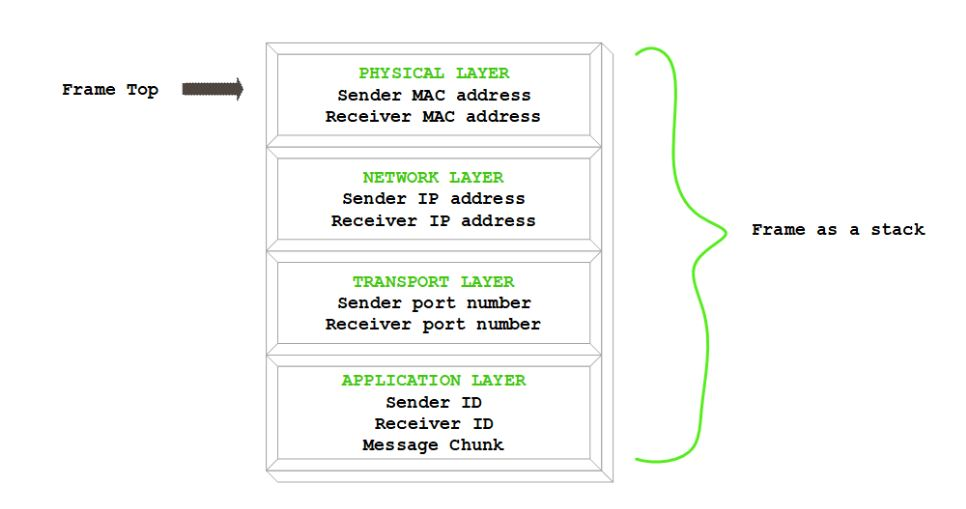
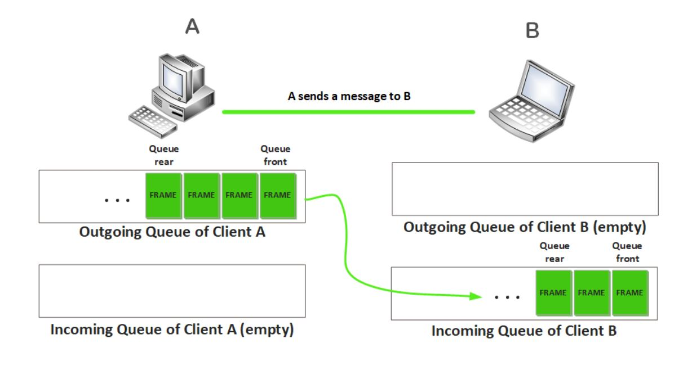

# c-network

Task is to design a simple version of network communication between peers within a network; that is, to implement a highly simplified  computer networking protocol family similar to the Internet protocol suite. The network will have a peer-to-peer model. The objective is to enable the peers to communicate to each other by exchanging messages while abiding by a set of protocols.

Summary of network services that need to implement is as follows:

- Enable communication between the clients within a network based on the set of proto-cols.
- Provide a simple routing of data packets using the clients’ routing tables.
- Enable logging of all network activity.
- Print log reports as necessary.

**Frames as Stacks (Last In First Out)**

Before data packets that carry message fragments can be sent, they will have to be encap-sulated into Data Link/Physical layer frames which must be implemented as stacks of information related to each network layer (e.g.  message fragment with sender and receiverIDs for the application layer, the sender and receiver’s IP addresses for network layer, port numbers for transport layer, physical MAC addresses for the physical layer, etc.)  as defined by the network protocol stack. 

**Outgoing and Incoming Queues (First In First Out)**

Each client will have send and receive buffers (that must be implemented as queues) for outgoing and incoming messages respectively (see the illustration below).  Can be assumed that the buffer size is infinite;  i.e.  no packets should ever be dropped because there is not enough space on a queue; rather, the queue will expand as much as necessary to accommodate any frames that need to be placed. Need to dynamically allocate and manage memory used by all queues as necessary.

**Logs*

Every network activity must be logged.  Thus,  each client will have its own log which willstore the information about the sent, received, and forwarded messages. Each log entry should store the following information:
- Timestamp:  the date and time of the activity
- Message that was carried in the frames
- Total number of frames that carried the whole message
- Total number of hops that frames have made so far through the network
- Sender ID
- Receiver ID
- Activity type (message sent, received or forwarded)
- Activity success status (successful or failed).
