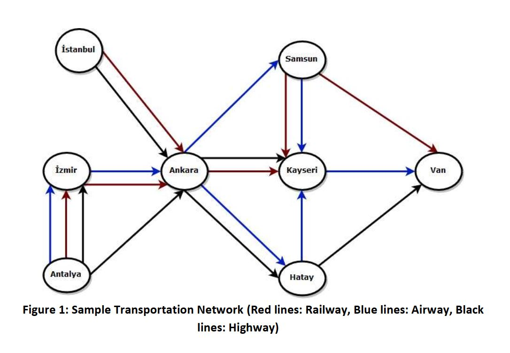

# java-transportation_network

There will be two input and one output file for this project. One input file for transportation network and other file to provide query operations. Output of the program will be written to output file. 

## Program usage : >java main transportation_network.inp query.inp result.out

This project is about directed graphs. Imagine that there is traveler and wants to go from a city to another city. In this problem, there are several choices for the transportation type. There may not be a direct path from the source city to the destination city, and thus have to pass some other cities to reach the destination. Passing through the cities, need to choose the transportation type of
the path connecting these cities.

3 transportation types are available:

*Highway
Airway
Railway*

There will be 5 commands to execute after creating the graph in this project.

**Q1 City1 City2 N Type**

where City1 and City2 denotes the source and
destination cities respectively and N a scalar. Task here is to find all the paths which
use at least N times the specific transportation type given in the query. The specific
transportation type could be H for Highway, A for Airway R for Railway. For this query, need to print a path satisfying the provided conditions, if there is any such path. 

**Q2 City1 City2 City3**

where City1, City2 and City3 denotes the source,
destination and intermediate cities, respectively.Ttask here is to list all the possible paths
from City1 to City2 by passing through an intermediate city denoted here as City3
only once.

**Q3 City1 City2 Type**

where City1 and City2 denotes the source and destination
cities respectively and Type can be H for Highway, A for Airway R for Railway.
For this query, task is to list the paths from City1 to City2 by going over the
specific transportation type represented by Type, if any such path exists.

**Q4 City1 City2 A{a} H{h} R{r}**

where A, H and R denotes the transportation
types airway, highway and railway, respectively. The parameter, a, h, and r represent
scalar values that are either 0 or positive and that represent how many times a specific
transportation type should be used. Task here is to find all possible paths from City1 to
City2 satisfying the given constraint.

**PRINTGRAPH**

This query will print graph structure.
